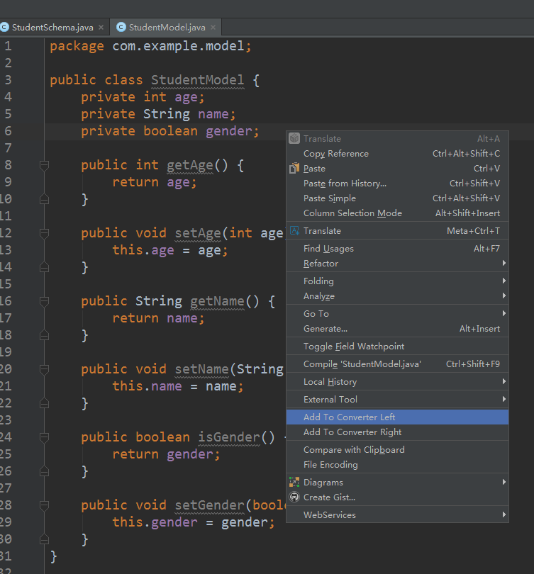
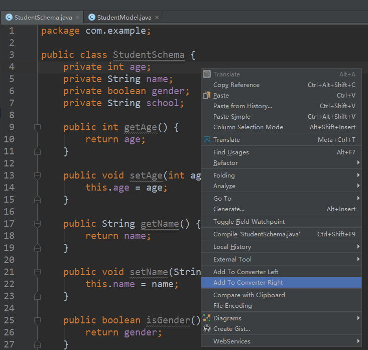
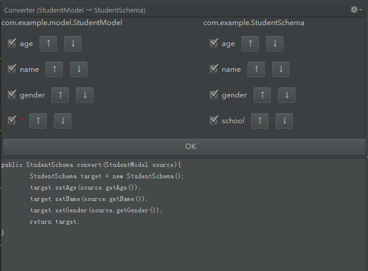

# intellij-converter
Intellij Idea Plugin, using to generate converter code with two entity class(pojo).

1. Add to converter left  
   
2. Add to converter right  
 
3. Gernate converter code (left -> right)   
  
